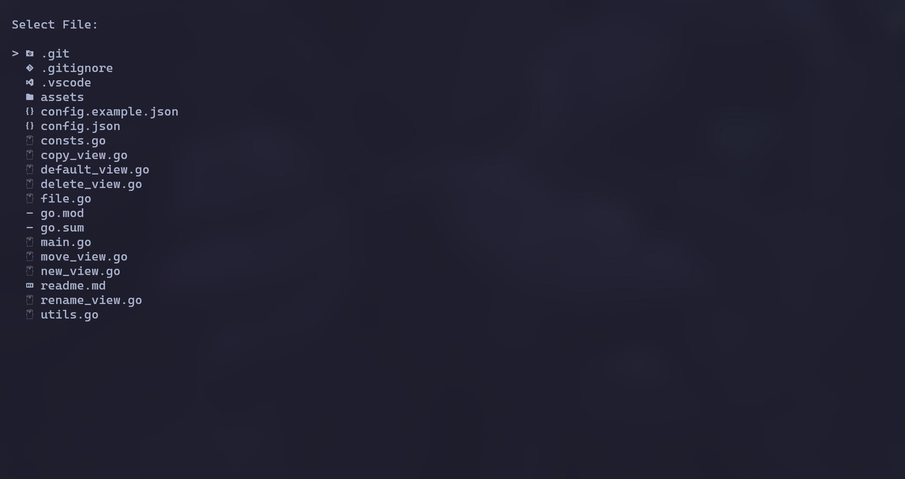

# What I want to add in the future:
- [x] read files
- [x] delete files
- [x] modify files (open editor)
- [x] rename files
- [x] move files
- [x] clipboard
- [x] icons
- [x] copy files
- [x] search files
- [ ] preview text files
- [ ] preview folders
- [ ] editor inside file-explorer
- [ ] copy path
- [ ] search multiple folders
- [ ] smb
# Installation
### For now you need to clone the repository and run it yourself using
```bash
go run .
```
# Known bugs
- When searching explorer can crash
- When view isn't default searching breaks almost everything
- cursor value doesn't change while searching which can cause crashes 